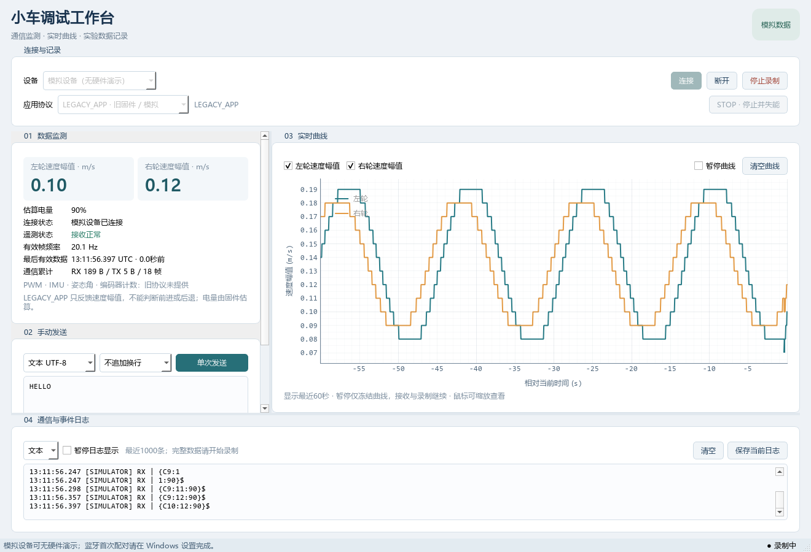

# 小车上位机：通信与监测工作台

使用 Python、PySide6、pySerial 和 PyQtGraph 搭建中文桌面工作台，提供串口、Classic 蓝牙 SPP 直连、模拟设备、监测、曲线和记录。v0.5.0 新增可选的本地 MCP、分阶段开环流程、结构化试次记录与报告。原有入口仍默认蓝牙 SPP 和 PROJECT_V1，按保存 MAC 在启动时尝试连接一次。PROJECT_V1 提供 CAPS 握手、有限 PWM、有限轮速 PI、四项 RAM 参数读取 / 应用 / 回读与设备停止状态。旧 LEGACY_APP 与模拟演示保留；暂不提供 EXE 或离线回放。

**新固件默认已选 PROJECT_V1**，按 [PROJECT_V1 使用说明](docs/PROJECT_V1使用.md) 操作。连接仅自动 HELLO 停止与建立新会话，不会自动使能、运动或恢复旧参数；有效 CAPS 与新鲜 STATE 才允许相应操作。新协议禁用原始发送，每个控制命令单次、有限时长，不续租或重发；自动化仅按逐阶段批准的实验表重新使能、执行下一次。

本地 MCP 和假设备演示见 [MCP 分阶段调试说明](docs/MCP分阶段调试.md)。双击 `启动自动化调试.bat` 开启本机控制接口并保持未连接；`启动假设备调试.bat` 仅允许注入 PROJECT_V1 软件假设备，不访问真实串口或蓝牙。MCP 自身不会启动 GUI 或连接小车。

用户已确认嵌入式接口完成、蓝牙通路可行，实物为 `WHEELTEC`、MAC `2A:A2:19:07:1B:8B`。本次新增的启动自动连接尚未另行连接实车验证；轮向、PI 稳定性和断联停车仍按实车验收记录判断。



## 安装与启动

需要 Windows 和 Python 3.11–3.14（锁定的 PySide6 支持到 Python 3.14）。本次开发环境使用 Python 3.14.6；依赖版本固定在 `requirements.txt`，开发测试依赖固定在 `requirements-dev.txt`。当前工作区的 `.venv` 已创建并安装，可以直接启动。

在“上位机”目录打开 PowerShell，首次创建项目独立的 `.venv` 并安装依赖：

```powershell
powershell -NoProfile -ExecutionPolicy Bypass -File .\setup.ps1
```

如果系统找不到 Python，或需要指定现有 Anaconda 解释器：

```powershell
powershell -NoProfile -ExecutionPolicy Bypass -File .\setup.ps1 -Python 'D:\Anaconda3\python.exe'
```

随后双击 `启动上位机.bat`，或运行：

```powershell
powershell -NoProfile -ExecutionPolicy Bypass -File .\start.ps1
```

启动脚本使用本目录的虚拟环境，不会自动联网安装依赖。缺少环境时会提示执行 `setup.ps1`；启动失败时，批处理窗口会保留错误信息。也可以在项目目录直接使用正式入口：

```powershell
.\.venv\Scripts\python.exe -m car_host
```

默认在窗口显示约 500 ms 后按已保存 MAC 尝试一次连接，失败或掉线后须手动连接。要让本次启动保持未连接，可运行以下命令；它不会修改已保存配置：

```powershell
.\.venv\Scripts\python.exe -m car_host --no-auto-connect
```

## 首次体验：无小车也可运行

1. 使用 `--no-auto-connect` 启动，在连接栏选择“模拟设备”并手动连接。选择模拟会自动切换到 LEGACY_APP，切回真实设备时恢复此前真实设备协议。
2. 模拟设备约每秒发送 20 帧，经过与真实串口相同的增量协议解析，驱动数据区和曲线；界面明确标注模拟来源。
3. 在发送区选择文本或 HEX，手动发送一次；日志展示实际发送的字节。模拟设备的发送记录不代表 MCU 执行或产生 ACK。
4. 点击开始录制，等待几秒后停止，在本项目 `data` 的会话目录检查遥测 CSV 和通信日志；保存路径显示在录制按钮的提示中。
5. 暂停日志或曲线显示后继续录制，再恢复显示。暂停只影响相应视图，接收、解析和录制继续运行。

## 工作台使用

顶部连接栏提供设备类型、连接与断开、录制状态；串口模式有 COM 和波特率，蓝牙 SPP 直连模式有扫描、名称 / MAC 筛选、设备 MAC 与 RFCOMM 通道。设备配置行提供本地别名、“启动时自动连接一次”和“保存设备配置”。四区可以随窗口调整大小：

较小窗口下，左侧数据与发送区域可以纵向滚动，以完整查看参数功能入口和说明。

| 区域 | 当前行为 |
|---|---|
| 数据监测 | LEGACY 显示速度幅值；PROJECT_V1 显示有符号轮速、编码器、软件 PWM、tick、电压、使能 / 停止原因及丢失计数 |
| 手动发送 / 功能 | LEGACY 文本或 HEX 单次发送；PROJECT_V1 禁用原始发送，按 CAPS 开放开环、PI 调参和轮速功能面板 |
| 通信日志 | 原始接收、发送、连接事件和异常，文本／HEX 切换，暂停显示、清空和保存；文本中的不可显示字节以转义方式展示 |
| 实时曲线 | 旧协议幅值 / 新协议有符号轮速、单位和图例，通道选择、暂停和清空，默认观察最近 60 秒 |

“已连接”只说明传输链路建立；收到正确格式的数据后才显示有效遥测。超过 1 秒未收到有效帧，数据标记为过期。畸形数据不会刷新有效数据时间。拔线、无线断开或通信失败会显示原因，程序不自动重连；重新连接需要手动操作。

“已发送”只表示字节已写入串口/SPP 传输层，模拟模式只接受发送记录，**不代表 MCU 接受或执行命令**。蓝牙发送超时表示结果未知：部分或全部字节可能已送达，程序不会自动重发。文本发送不会替你构造运动协议；HEX 用于发送明确已知的字节，例如 `7B 43 30 3A 30 3A 38 30 7D 24`。这个示例编码的是遥测文本 `{C0:0:80}$`，不是小车控制命令。

旧 MCU 的 USART2 接收链存在裸字符串 `reset` 复位匹配和 AT 字符串拦截。新固件隔离完整 PROJECT_V1 候选帧与 reset 匹配，上位机 PROJECT_V1 禁用原始发送。烧录前停止并断开上位机，由已有烧录工具独占连接。

## Classic 蓝牙 SPP 直连

这一路径直接连接经典蓝牙 RFCOMM/SPP 服务，不要求 Windows 创建虚拟 COM 口，也不是 BLE/GATT。首次配对在 Windows 蓝牙设置中完成；本程序不代替系统配对，不提供无线烧录。

1. 打开电脑蓝牙，在 Windows 设置中与小车模块配对，确认模块空闲、未被其他烧录器或调试程序占用。
2. 上位机默认蓝牙 SPP / PROJECT_V1，预填用户确认的 MAC `2A:A2:19:07:1B:8B`，直接按地址连接，不必每次扫描或修改模块名称。需要换车时可扫描并按名称或 MAC 筛选，也可以手动填写地址；同名设备按 MAC 区分。
3. 选择 RFCOMM 通道，默认 `1`，允许 `1–30`。`1` 来自历史配置并保留为默认值，本次未重新核实实际服务通道；该数值**不是 COM1 或波特率**。
4. 核对本地别名、MAC、通道和协议，按需要勾选“启动时自动连接一次”，点击“保存设备配置”。之后启动会按保存配置尝试一次；失败或掉线后查看原因并手动连接。
5. 链路建立后先观察原始字节，再确认 PROJECT_V1 握手和有效遥测。没有正确帧时，核对模块、通道及当前运行的 MCU 应用固件。

设备身份以已保存 MAC 为连接依据，名称 `WHEELTEC` 和默认本地别名“我的小车”只用于显示；别名不会发送给模块，也不会修改模块名称。烧录说明中出现的 JDY-33 仍只是候选型号。

“保存设备配置”只保存蓝牙配置和启动开关到 `上位机/config/preferences.json`，不发起连接、不保存运动目标或 PI 参数。修改连接字段、扫描、手动连接或断开会取消本次尚未执行的启动尝试；保存后不会重新安排尝试。关闭启动开关并保存后，后续启动保持未连接。配置损坏、版本不支持或读取失败时会显示警告并关闭本次自动连接，供检查后手动连接或重新保存；程序没有后台重试。

扫描和连接期限各为 10 秒，发送期限为 3 秒；停止给予子进程 2 秒清理时间，超限后父程序结束该子进程。QtBluetooth 在独立 Python 子进程中运行 QCoreApplication，父界面通过 QProcess 异步管道监督；底层调用异常时不会让界面等待同步读写。关闭窗口会等待后台异步收尾。进程结束不能作为 MCU 已停止或此前字节未送达的证明。

当前主工程 USART2 配置为 230400/8N1，模块 UART 必须与之匹配，其实际配置仍需核对；电脑直接 RFCOMM 连接没有串口波特率设置。若 Windows 已提供蓝牙虚拟 COM，也可继续选择原串口模式，按实际配置连接。

## 真实串口接入与旧固件遥测

旧 LEGACY 文本遥测与新 PROJECT_V1 二进制遥测均使用 **USART2，230400 baud，8N1，无硬件流控**。新固件硬件初始化参数保持原样。USB 插入后电脑出现 COM 口，并不证明它连接到了 USART2；必须核对实物板卡版本、USB 桥对应的 UART 和接线。

1. 接入设备后刷新串口，选择已确认对应数据口的 COM 号。
2. 选择与该固件匹配的波特率，当前 USART2 默认使用 230400。
3. 手动连接，先查看原始日志，再确认有效遥测状态与数值更新。
4. 若已打开但没有有效数据，核对 USB 对应 UART、固件输出通道、波特率和原始字节，不将“已连接”作为运动状态反馈。

首版接受的 ASCII 帧为：

```text
{C左轮速度幅值整数:右轮速度幅值整数:估算电量整数}$
{C12:15:80}$
```

示例换算得到左轮 0.12 m/s、右轮 0.15 m/s、估算电量 80%。旧 LEGACY 固件发送前对轮速取绝对值，无法从这条遥测判断前进或后退。电量是固件由电压估算的百分比，不是电压测量值；越界原值被保留并标记异常，不强行裁剪为正常电量。

解析器支持拆包、粘包、噪声和错误帧后重新同步。接收时间来自电脑；当前帧没有设备时间、序号、CRC 或命令执行反馈，因此无法据此测量 MCU 采样时刻、链路单向时延或证明数据来源真实性。

旧 LEGACY 主工程格式与厂商完整参考固件不同：前者的 C 帧是上述轮速幅值/估算电量；厂商参考固件普通遥测用 A 帧、波形用 B 帧、C 帧用于 PID 等参数。相同字母不代表相同协议，程序不自动识别或切换固件格式；恰好匹配该帧形状的字节仍会按已选协议解释。`LEGACY_APP` 只适用于已确认的旧格式，新编译固件使用 PROJECT_V1；接入其他固件前应核对数据并注册相应的协议适配器。

## 数据记录

录制由用户手动开始和停止，默认目录为 `上位机/data`。每次会话写入遥测 CSV 和原始通信日志，包含电脑接收时间、数据来源及有效性信息；CSV 以 `connection_id` 追溯连接，日志以 `request_id` 追溯发送请求，保存设备与协议配置。PROJECT_V1 记录设备 session / last_seq / tick、signed speed、PWM、编码器、使能 / 停止原因、revision 与丢失计数；LEGACY 缺失字段保持空缺。打开 CSV 时可使用支持 UTF-8 的表格软件。

屏幕日志和绘图历史采用有界缓存。清空或暂停显示不删除正在录制的数据；屏幕历史淘汰与录制不是一回事。录制失败或记录缓冲溢出会显示原因，不能将有缺失的记录视为完整实验数据。停止录制或关闭程序时会收尾文件；文件名和实际保存位置以界面提示为准。

单次发送最多 4096 字节，待发送缓存 128 条，通信事件缓存 1024 条，扫描设备最多 128 个。屏幕保存最近 1000 条日志，曲线保留最近 60 秒且最多 6000 点，录制队列 2048 条；蓝牙 IPC 消息及解析缓冲另设上限。发生丢失会记录诊断与会话不完整状态，连接结束状态另行保留，避免被大量 RX 淘汰。

## 开发与扩展

源码集中在 `car_host` 包，按界面、应用协调、通信、协议和数据记录分层。真实串口由后台线程独占；Classic SPP 由受监督的子进程拥有；模拟传输层复用同一解析和数据通路。`device.py` 提供协议工厂、冻结的能力快照和 `ParameterService`，`tools.py` 提供功能面板注册。详细 API 与扩展步骤见 [架构与扩展](docs/架构与扩展.md)。

新增 MCU 协议时注册适配器并映射统一遥测模型；PROJECT_V1 能力只由 CAPS 启用。语义命令由适配器的 `encode_command` 编码，传输层不解释 PI。面板通过服务访问 Controller，不能直接写串口或蓝牙。旧协议的参数读取 / 修改明确返回 `unsupported`，不会发送猜测字节；链路连接本身不启用参数或运动功能。

当前双端协议与实现见 [MCU 对接方案](docs/MCU对接方案.md) 和 [PROJECT_V1 使用说明](docs/PROJECT_V1使用.md)。实车先核对有符号编码器 / 轮向，再做单轮短时开环测量、人工 PI 调参和有限轮速验收。

测试命令：

```powershell
.\.venv\Scripts\python.exe -m pytest
```

测试覆盖解析与恢复、模拟设备、通信故障注入、有界缓存、结束竞态、录制失败与完整性、退出保存、界面暂停期间继续记录，以及设备能力与扩展接口。蓝牙收发可使用注入的子进程后端验证挂起、超时、异常退出、IPC 分片与清理；这类软件验证不连接真实蓝牙模块。

v0.4.0 完整回归通过 344 项测试和 4 个子测试，依赖检查正常。当前结果、界面截图及待实车联调清单见 [验证记录](docs/验证记录.md)。

用户已报告蓝牙通路可行，并确认上述实物 MAC。本次启动自动连接实现尚未进行真实蓝牙连接验证，也未新增实车运动、轮向、PI 稳定性、断联停车或真实串口占用 / 拔线验收。软件测试不能替代这些实车检查；历史测试结果见验证记录，不能当作 v0.4.0 自动连接的硬件验收。

可重新生成模拟界面验收截图：

```powershell
.\.venv\Scripts\python.exe .\scripts\verify_gui.py .\.qa\workbench.png
```

截图工具用模拟历史补齐60秒绘图区，真实执行一次模拟连接、发送、录制和关闭；截图中的曲线不是实车测量。

仅查看未连接的蓝牙配置界面（不扫描或操作设备）：

```powershell
.\.venv\Scripts\python.exe .\scripts\verify_gui.py .\.qa\bluetooth.png --bluetooth
```

Windows Anaconda 环境启动时会在当前进程预加载系统 ICU，以避免 Qt 与 Conda ICU 的 DLL 入口冲突；不会修改系统 PATH、注册表或全局环境。
